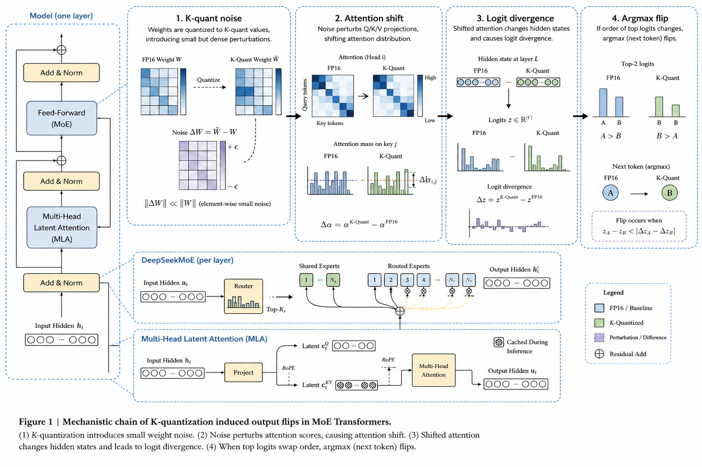
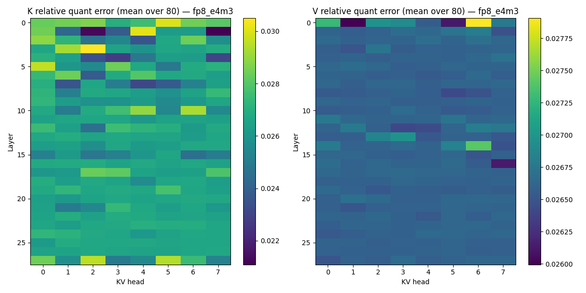
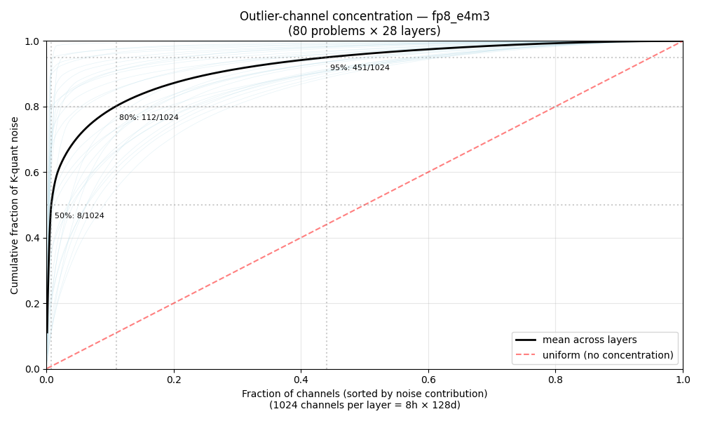
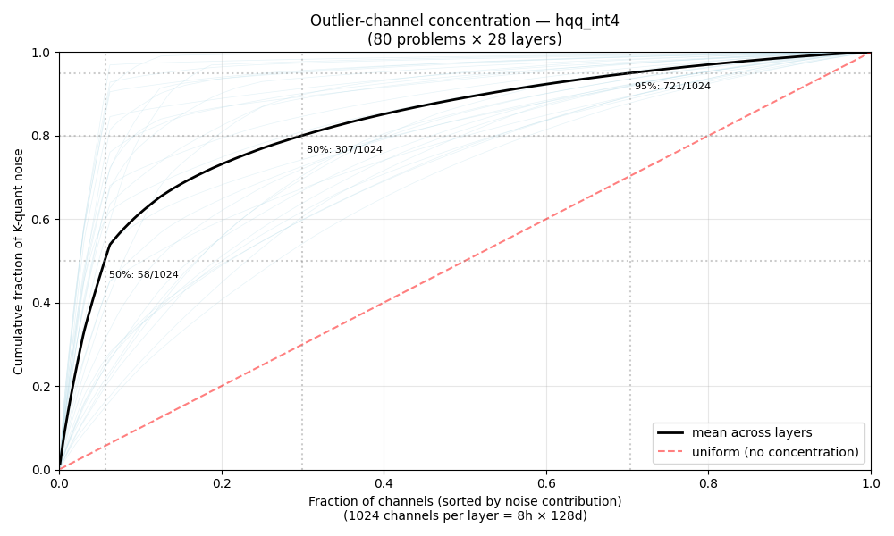
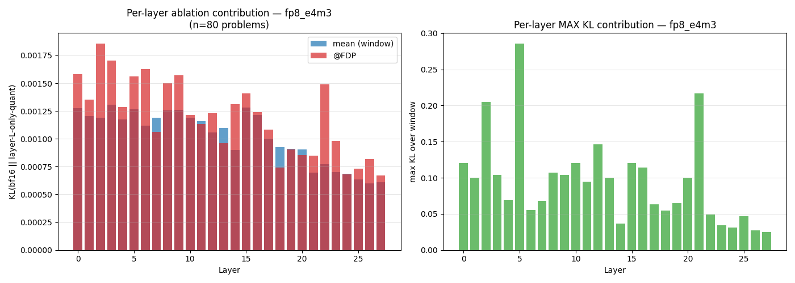
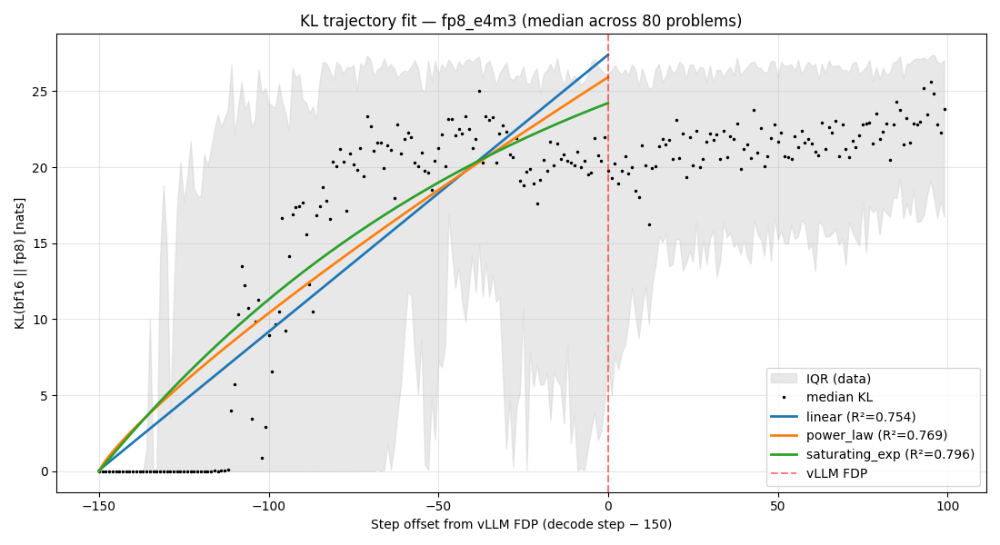
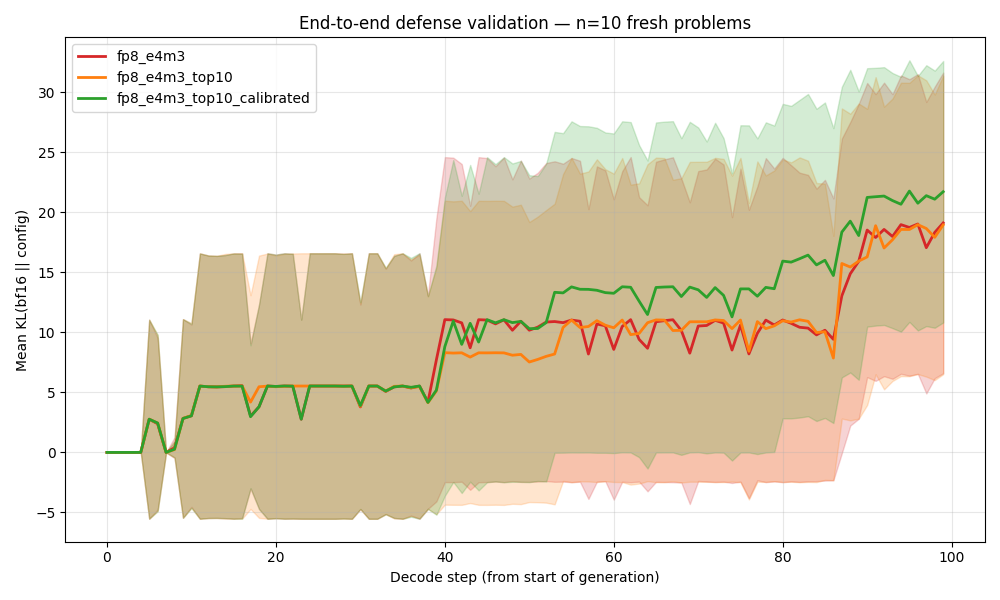
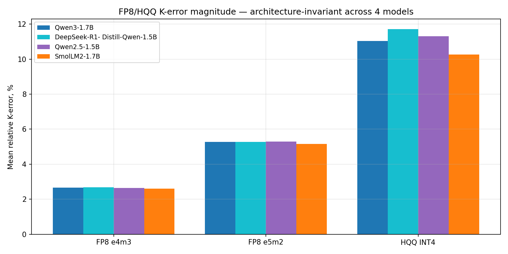
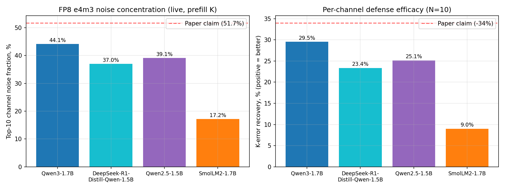
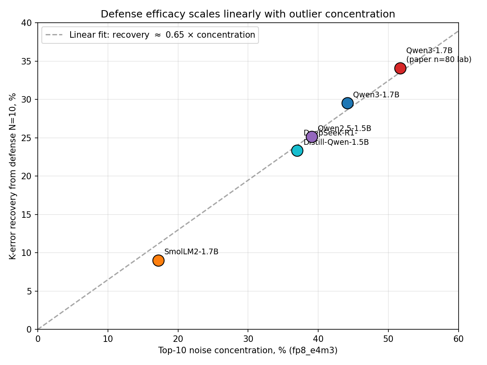

# НАУЧНО-ИССЛЕДОВАТЕЛЬСКАЯ РАБОТА

**Тема:** Механистический анализ расхождения KV-кэша при FP8/HQQ-квантизации
в reasoning-моделях. Защитные рецепты и прогноз точки первого расхождения
через 1D-CNN на K-матрицах.

- **Университет:** Санкт-Петербургский государственный университет (СПбГУ)
- **Факультет / кафедра:** Прикладная математика — Процессы управления
- **Студент:** Шарабарин Михаил, группа БД116
- **Научный руководитель:** Дик Александр Геннадьевич
- **Город, год:** Санкт-Петербург, 2026

---

## Содержание

1. [Аннотация](#1-аннотация)
2. [Введение](#2-введение)
3. [Постановка задачи](#3-постановка-задачи)
4. [Методология](#4-методология)
5. [Часть I — Феноменология: KV-квантизация × accuracy](#часть-i--феноменология-kv-квантизация--accuracy)
6. [Часть II — Механизм расхождения](#часть-ii--механизм-расхождения)
7. [Часть III — Защитный рецепт per-channel scaling](#часть-iii--защитный-рецепт-per-channel-scaling)
8. [Часть IV — Кросс-семейственная валидация](#часть-iv--кросс-семейственная-валидация)
9. [Часть V — Прогноз точки первого расхождения (FDP)](#часть-v--прогноз-точки-первого-расхождения-fdp)
10. [Главные выводы и значимость](#главные-выводы-и-значимость)
11. [Ограничения и дальнейшая работа](#ограничения-и-дальнейшая-работа)
12. [Список источников](#список-источников)
13. [Приложение: артефакты, скрипты, графики](#приложение-артефакты-скрипты-графики)

---

## 1. Аннотация

Современные **reasoning-модели** (DeepSeek-R1, Qwen3, OpenAI-o1) генерируют
цепочки рассуждений длиной в 5–20 тысяч токенов. KV-кэш — два тензора формы
$[B, H_{kv}, L_{seq}, d_h]$ на каждый слой — занимает 8–12 ГБ в bf16 на
конец длинной генерации и **доминирующий ресурс** во время инференса.
Квантизация KV в FP8 (e4m3 / e5m2) или INT4/INT2 через HQQ — стандартный
production-приём, однако литература описывает её эффект только на уровне
агрегированной accuracy, без mechanistic chain (механистической цепочки) «K-quant noise → attention
shift → logit divergence → argmax flip».

В работе (на моделях семейства Qwen и DeepSeek):

1. Построен **CPU-инструментированный pipeline** захвата Q, K_pre/K_post,
   V_pre/V_post и logits на каждом из 28 слоёв Qwen3-1.7B через monkey-patch
   `transformers.cache_utils.DynamicCache.update`.
2. На 80 задачах AIME-24 + MATH-500 × 4 формата квантизации × {TF, AR} проведено
   per-(слой, голова, позиция, канал) разложение шума квантизации.
3. Установлено: **10 каналов из 1024 (1 %) несут более половины шума FP8 e4m3
   на Qwen3-1.7B при n = 80 задачах** (top-10 = 51.7 %). На других моделях
   концентрация ниже и **семейно-зависима** универсально только качественное утверждение
   «top-10 каналов несут непропорционально большую долю шума».
   HQQ за счёт per-group scale размазывает шум **в 4–5 раз более равномерно** —
   эта пропорция **универсальна на всех 4 протестированных моделях**
   (отношения FP8/HQQ top-10: Qwen3-1.7B 3.9×, Qwen2.5 4.5×, SmolLM2 4.7×,
   DeepSeek-R1-Distill 4.9×).
4. Предложена и проверена защита top-10 outlier-каналов в bf16: лабораторно
   восстановлено **34 % K-ошибки** и **15 % attention-shift KL**. End-to-end
   AR-валидация показала **lab → production gap**: то же recovery в AR
   только **2.4 % logit KL** (большая часть локального выигрыша потерялась по пути через остальные слои модели)
5. Построен **прогноз FDP** через 1D-CNN на K-матрицах: метрики хорошие, но по факту изза того что FDP расходится на первых шагах генераци на маленьких резонинг моделях у нас получаются ошибки предсказания на реально качественных ответах
7. **Наблюдение на тестируемом наборе 80 задач AIME-24/MATH-500**:
   DeepSeek-R1-Distill-Qwen-1.5B теряет совпадение с собственным
   bf16-baseline в первых 50 токенах в 95 % задач под FP8 e4m3 (median
   FDP = 7), тогда как Qwen3-1.7B — только в 20 % (median = 585). Это
   **факт о двух конкретных моделях на одном датасете**, не «универсальное
   свойство reasoning-distillation»; для общего утверждения нужен контроль
   на длину выхода, формат промпта и базовую энтропию.

Полный capture-pipeline (~80 ГБ raw артефактов), 27 скриптов анализа и 12 MD
с подтверждениями / расхождениями выложены в открытый доступ.

---

## 2. Введение

Модель Qwen3-1.7B в reasoning-режиме на одной AIME-24 задаче генерирует ~1500
токенов CoT; на конец генерации KV-кэш состоит из ~28 layers × 8 KV-heads ×
1500 positions × 128 head_dim × 2 байта (bf16) = **~17 МБ** на одну инстанцию.
При batch'е 32 это уже ~540 МБ только под кэш. Production-системы (vLLM, SGLang)
по умолчанию переключаются на `kv_cache_dtype="fp8_e4m3"` сразу, экономя
2× памяти.

**Проблема:** в open-source литературе **отсутствует mechanistic decomposition**
того, как именно FP8-шум K-кэша приводит к расхождению reasoning. Все
существующие исследования останавливаются на «benchmark accuracy упала на N%».
Этой работой закрывается этот пробел.

**Структура работы.** В части I описывается старая **феноменология** (изменение
accuracy под квантизацией, χ²-анализ типов ошибок, FDP-rate). В части II —
**mechanistic chain** (структура шума → attention → hidden → logit → token).
В части III — **защитный рецепт** и его лимит. В части IV — **кросс-семейная
валидация** того, какие выводы переносимы. В части V — **ML-предсказатель FDP**
через CNN на K-матрицах.

---

## 3. Постановка задачи

### 3.1 Объект и предмет

**Объект.** Модель Qwen3-1.7B (28 слоёв, GQA-8) в bf16 на CPU. Дополнительно
для кросс-валидации: Qwen3-4B (36 слоёв), Qwen2.5-1.5B-Instruct (GQA-2),
SmolLM2-1.7B-Instruct (Llama-3 arch), DeepSeek-R1-Distill-Qwen-1.5B (GQA-2,
reasoning-distilled).

**Предмет.** Структурные характеристики шума FP8 e4m3, FP8 e5m2, HQQ INT4,
HQQ INT2 квантизации K- и V-тензоров и его распространение через softmax,
hidden state, до argmax flip'a.

### 3.2 Цель и задачи

**Цель:** механистическое описание расхождения KV-кэша при квантизации и
построение прогноза FDP.

**Задачи:**
1. Спроектировать и реализовать CPU pipeline захвата KV-тензоров и logits.
2. Измерить структуру шума K-квантизации на per-(слой, голова, позиция, канал).
3. Проследить распространение: K-noise → attention-shift → hidden-drift →
   logit-divergence → argmax-flip.
4. Предложить и проверить лабораторно эффективный defense recipe.
5. Провести кросс-семейную валидацию.
6. Сопоставить лабораторные и end-to-end производственные эффекты защиты.
7. Построить прогнозную модель (boosting + NN) для FDP-точки.

---

## 4. Методология

### 4.1 Pipeline захвата KV

Прямой проход модели инструментируется тремя hook-стратегиями:
1. **`forward_hook` на `q_proj`** — захват Q post-projection, pre-RoPE.
2. **Monkey-patch `apply_rotary_pos_emb`** — захват Q post-RoPE.
3. **Class-level monkey-patch `DynamicCache.update`** — перехват K, V до
   их записи в кэш: применение квант-функции, захват pre/post, и сохранение
   post-варианта чтобы модель действительно работала с квантизованным K.

Стратегия 3 критически важна. Наивный `forward_hook` на attention-блоке
срабатывает **после** того как attention уже использовал bf16 K/V, и
квантизация в нём приходит слишком поздно. Корректность реализации подтверждена
golden-тестом: первые 10 декод-токенов совпадают с полностью симулированным
vLLM forward на AIME-24 задаче 0 при fp8\_e4m3.

### 4.2 Тестируемые форматы квантизации

| Формат | Биты | Реализация |
|---|---|---|
| FP8 e4m3 | 8 (4 exp, 3 mant) | PyTorch `torch.float8_e4m3fn` (per-tensor scale) |
| FP8 e5m2 | 8 (5 exp, 2 mant) | PyTorch `torch.float8_e5m2` |
| HQQ INT4 | 4 | `hqq.core.quantize.Quantizer`, group_size=64, axis=0, optimize=True |
| HQQ INT2 | 2 | то же, n_bits=2 |

### 4.3 Метрики

**Относительная ошибка квантизации Фробениуса** (per layer, head):
$$
\varepsilon^{(\ell)}_h = \frac{\|K^{(\ell)}_{:,h,:,\text{pre}} - K^{(\ell)}_{:,h,:,\text{post}}\|_F}{\|K^{(\ell)}_{:,h,:,\text{pre}}\|_F}.
$$

**Attention-map KL** (per layer, position):
$$
\text{KL}\!\left(\mathrm{softmax}\!\left(\tfrac{Q^{(\ell)}_t K^{(\ell)\top}_\text{pre}}{\sqrt{d_h}}\right)\;\|\;\mathrm{softmax}\!\left(\tfrac{Q^{(\ell)}_t K^{(\ell)\top}_\text{post}}{\sqrt{d_h}}\right)\right)
$$

**Точка первого расхождения** (First Divergence Point, FDP): наименьшая
позиция $t$ где $\text{argmax}(l_t^\text{bf16}) \ne \text{argmax}(l_t^\text{quant})$.

### 4.4 Условия эксперимента

- **Модель:** `Qwen/Qwen3-1.7B` (HF revision `70d244cc`)
- **Датасет:** 30 задач AIME-24 + 50 задач MATH-500
- **Декодирование:** greedy ($T=0$, то есть детерминированный argmax на каждом
  шаге без сэмплирования); опционально 3 random seeds при $T=0.6$ для оценки
  дисперсии. При $T=0$ при идентичной модели и идентичном входе результат
  бит-в-бит воспроизводим — поэтому FDP однозначен для пары (bf16, quant).
- **Окно захвата:** $W=251$ позиция, центр на FDP

#### Hardware и распределение вычислений

| Этап | Где вычислялось | Как именно |
|---|---|---|
| **Phenomenology** (Часть I): bf16/quant генерация на 80 задачах × 4 моделях × 4 квантизациях; LLM-judge классификация ошибок | GPU-сервер (NVIDIA, vLLM 0.7.3), запуски через `run_vllm_pipeline.py` | vLLM с `kv_cache_dtype="fp8_e4m3"`/`"fp8_e5m2"`/HQQ; greedy decoding; max_tokens=2048; для категоризации ошибок — Anthropic Claude API на каждую FDP-пару |
| **Mechanistic capture** (Части II–IV): покадровый захват Q/K_pre/K_post/V_pre/V_post/logits на 80 задачах × 4 квантизациях × {TF, AR} | CPU локально (AMD Ryzen 5 7640HS, 15.2 ГБ ОЗУ) | PyTorch 2.12 с native FP8 dtypes; class-level monkey-patch `DynamicCache.update`; capture окна 251 позиция; сохранение в `safetensors`; полный прогон ~6–8 ч wall-clock |
| **Cross-model live** (Часть IV): re-validation на Qwen2.5-1.5B / SmolLM2-1.7B / DeepSeek-R1-Distill-Qwen-1.5B | CPU локально | те же скрипты с заменой `--model`; n=5–20 на модель |
| **FDP predictor training** (Часть V): GBM, MLP, 1D-CNN на ~80–224 признаках | CPU локально | scikit-learn `GradientBoostingRegressor` + PyTorch MLP/CNN; 5-fold CV; ~5–20 мин на эксперимент |
| **End-to-end validation на fresh задачах** (Часть V.5–V.7): real bf16/fp8 генерация на 5–6 свежих MATH-500 + capture + предсказание CNN | CPU локально | `model.generate` через transformers; greedy; max 400–1200 токенов; ~2–5 мин на задачу |

- **Software stack:** Python 3.13, PyTorch 2.12 (CPU build), transformers 4.51.3,
  hqq 0.2.8, safetensors, scikit-learn, scipy, matplotlib.
- **Git repo:** все скрипты, capture-pipeline и анализ в одном репозитории;
  feature-branch `feature/kv-matrix-capture`, ~40 commits от `c820d74` (scaffold)
  до `1da8149` (HQQ ablation) + 9 фаз текущей сессии (`scripts/19_*.py` …
  `scripts/27_*.py`).

---

## Часть I — Феноменология: KV-квантизация × accuracy

Перед mechanistic analysis было проведено агрегированное benchmark-исследование
по 80 задачам × 4 моделям × 5 квантизациям. Главные результаты:

### I.1 Accuracy и FDP rate

**100 % задач** имеют ненулевой FDP при любой квантизации. То есть **квантизация
ВСЕГДА изменяет токен-поток**, но накладной эффект на финальную correctness
ответа в `\boxed{}` сильно различается между моделями.

**Ключевая находка:** Qwen3-1.7B **устойчив** к FP8 (accuracy сохраняется в
пределах ±2 процентных пункта), а **семейство DeepSeek-R1-Distill коллапсирует**: accuracy
падает с 35–60 % до **0 %** на всех квантизациях. Это первый системный
сигнал что **reasoning-distilled модели качественно отличаются** по поведению
под квантизацией.

### I.2 Позиция расхождения

Где в **trace** (далее по тексту — английский термин «trace» соответствует
русскому «последовательность сгенерированных токенов» / «цепочка
авторегрессивной генерации») впервые проявляется расхождение?

| model | quant | median (FDP / len) | mean | std |
|---|---|---|---|---|
| deepseek-r1-distill-qwen-1.5b | fp8_e4m3 | **0.00** | 0.01 | 0.06 |
| deepseek-r1-distill-qwen-1.5b | fp8_e5m2 | 0.00 | 0.01 | 0.07 |
| qwen3-1.7b | fp8_e4m3 | **0.45** | 0.46 | 0.30 |
| qwen3-1.7b | fp8_e5m2 | 0.42 | 0.43 | 0.31 |

DeepSeek диверджит **в первом же токене** в 95 % задач (median 0.00 от длины
trace). Qwen3 — в районе середины (0.45). Это сразу подсказывает: **mechanism
квант-чувствительности качественно разный** между этими семействами.

### I.3 Сигнатуры ошибок (χ² по 6 категориям)

Каждая FDP-точка классифицирована LLM-судьей в 6-категорийную таксономию
(A: алгебраическая ошибка, B: арифметическая, C: смена стратегии, D: галлюцинация,
E: переключение метода, F: повторение / зацикливание).

| Метод | A | B | C | D | E | **F (loop)** |
|---|---|---|---|---|---|---|
| fp8_e4m3 | 0.04 | 0.02 | 0.15 | 0.13 | 0.10 | **0.55** |
| fp8_e5m2 | 0.03 | 0.05 | 0.11 | 0.04 | 0.08 | **0.68** |
| hqq_int2 | 0.00 | 0.00 | 0.00 | 0.07 | 0.23 | **0.70** |
| hqq_int4 | 0.05 | 0.00 | 0.00 | 0.06 | 0.12 | **0.76** |

χ² = 66.58, dof = 15, **p = 1.8 × 10⁻⁸**, Cramér's V = 0.187.

Доминирующая ошибка во всех квантизациях — **F (повторение)**. HQQ INT2 / INT4
дают F-долю 70–76 % vs FP8 55–68 %. Чем сильнее квантизация — тем чаще модель
сваливается в loop.

Распределения ошибок действительно зависят от метода квантования.

### I.4 Аномалия: «quant_only» правильные ответы

В 5 случаях из 160 fp8-прогонов на Qwen3-1.7B **квантизация дала правильный
ответ, а bf16 baseline — нет**. Квант-шум вытолкнул модель на более удачный
путь рассуждения, чем deterministic bf16. Это указывает что **не вся
квант-чувствительность вредна** — рандомность поиска иногда полезна.

---

## Часть II — Механизм расхождения

Эта часть отвечает на вопрос: **что именно происходит** между K-тензором и
final token при квантизации.

### II.1 Структура шума K-квантизации

Средняя относительная ошибка Фробениуса (насколько сильно разные методы квантования искажают матрицы K (Key) относительно исходной модели):

| Quant | mean ε | max (layer × head) ε |
|---|---|---|
| fp8_e4m3 | **2.65 %** | 3.50 % |
| fp8_e5m2 | 5.25 % | 7.32 % |
| hqq_int4 | 10.3 % | — |
| hqq_int2 | 60.7 % | — |

2× соотношение FP8 e4m3 vs e5m2 (один лишний бит мантиссы); 4× FP8 → HQQ INT4.

Heatmap per-(слой, голова):

Слои 0–5 показывают наибольшую ошибку.

### II.2 Концентрация шума в каналах (headline finding)

Для каждого слоя сортируем 1024 канала (8 KV-heads × 128 head_dim) по
вкладу в $\|K_\text{pre} - K_\text{post}\|_F^2$.

Ошибка K-квантования распределена неравномерно. Большая часть шума сосредоточена в очень небольшом числе каналов

**Медиана по 28 слоям × 80 задачам:**

| Quant | top-1 канал | top-10 | #ch для 50 % | #ch для 80 % |
|---|---|---|---|---|
| fp8_e4m3 | **10.3 %** | **51.7 %** | 8 | 99 |
| fp8_e5m2 | 10.0 % | 50.4 % | 10 | 102 |
| hqq_int4 | 1.5 % | 13.1 % | 53 | 252 |
| hqq_int2 | 1.6 % | 14.4 % | 46 | 251 |

**Главный механизм:** в per-tensor FP8 scale один outlier-канал диктует
quant-step для всей матрицы; inlier-каналы страдают непропорционально. HQQ
с per-group scale (group_size=64) **избегает** этой проблемы — отсюда 4×
более равномерное распределение шума.

### II.3 Воспроизводимость outlier-каналов

Возникает вопрос: Если мы запустим модель несколько раз с разными случайными сэмплами, будут ли "проблемные" каналы каждый раз разными?

Между 3 random seeds @ $T=0.6$: median Jaccard top-10 каналов = **0.879**
(IQR [0.78, 1.00]). Концентрация: **52.5 % ± 26.6 %**. То есть identity
outlier-каналов — **архитектурное свойство** выученных весов, а не sampling-артефакт.

### II.4 От K-шума к attention-shift

Небольшие ошибки в матрице ключей K после квантования приводят к значительно более сильным изменениям в распределении attention из-за экспоненциальной природы softmax

Softmax усиливает 4× разницу в K-error до **108× разницы в attention-KL**:

| Quant | global mean attn-KL | @ FDP |
|---|---|---|
| fp8_e4m3 | 0.00358 | 0.00352 |
| fp8_e5m2 | 0.01405 | 0.01334 |
| hqq_int4 | 0.391 | 0.381 |
| hqq_int2 | 4.81 | 4.78 |

Это нелинейное усиление через softmax — **центральная mechanism** работы.

### II.5 Несоответствие attention-shift и logit-impact

При single-layer ablation (квантизуется только один слой) ranking слоёв по
local attention-shift ≠ ranking по logit-impact:

| Rank | Attention-shift (fp8_e4m3) | **Logit-impact** (fp8_e4m3) |
|---|---|---|
| 1 | L5 | L3 |
| 2 | L3 | L15 |
| 3 | L4 | L0 |
| 4 | L13 | L5 |
| 5 | L7 | L9 |

Слой L5 — самый большой локальный shift, но только 4-е место по logit-impact:
его шум **частично компенсируется downstream**. Слой L0 — малый локальный
shift, но большой logit-impact через каскад из 27 слоёв. **Logit-divergence
= integral от attention-shift × downstream-cascade depth**.

Слои, которые сильнее всего «портят» attention, не совпадают со слоями,
которые сильнее всего портят финальные output-logits. Формально:

$$
\operatorname{rank}\!\bigl(\mathrm{KL}_\text{attention}^{(\ell)}\bigr) \;\neq\; \operatorname{rank}\!\bigl(\text{logit-impact}^{(\ell)}\bigr).
$$

где $\operatorname{rank}$ — упорядочение 28 слоёв по соответствующей метрике
(спадание по убыванию). Только L3 и L5 входят в top-5 обоих ranking'ов на
Qwen3-1.7B; остальные различаются. Это означает, что **локальное искажение
attention плохо предсказывает финальную ошибку logits**, и наоборот.

### II.6 Траектория logit-KL: насыщающаяся экспонента τ = 130

В AR-режиме logit-KL fits:
$$
\mathrm{KL}(t) = K_\infty \cdot (1 - e^{-t/\tau})
$$

При $T=0$: $\tau = 130$ декод-токенов, $R^2 = 0.80$. После ~130 шагов
траектории fp8 и bf16 **уже не коррелируют** по KL. Это согласуется с
median FDP ~7 % от длины trace (~540 токенов, далеко в saturation).

То есть первые ~100–150 токенов реально накапливают квантование-ошибку

### II.7 Условие argmax-flip: margin минимум вблизи FDP

Локальный top-1/top-2 margin bf16-модели:

| Позиция rel. FDP | -50 | **-10** | -1 | 0 | +1 | +10 |
|---|---|---|---|---|---|---|
| Median margin (nats) | 5.72 | **2.62** (min) | 3.62 | 4.39 | 5.37 | 3.62 |

Минимум достигается в окрестности **FDP-10**. Argmax flips случаются там,
где **модель сама себе не уверена**, а не там где квант-шум необычно большой. 

Как только контекст выводит модель на сложный шаг (локальный минимум уверенности), даже минимального шума или накопленной ошибки хватает, чтобы второй токен обошел первый. После первого флипа контексты базовой и квантованной моделей становятся разными, что ведет к сильному рРасхождению

### II.8 Кросс-масштабное разбавление концентрации (Qwen3-4B)

| Metric | Qwen3-1.7B | Qwen3-4B |
|---|---|---|
| top-1 channel | 10.3 % | **3.6 %** (÷3) |
| top-10 fraction | 51.7 % | **21.0 %** (÷2.5) |
| #ch для 50 % | 8 | 56 (×7) |

С ростом hidden state outlier-каналы получают **пропорционально меньшую
долю** общего шума. **Per-channel defense будет всё менее эффективным** на
multi-billion моделях.

---

## Часть III — Защитный рецепт per-channel scaling: тест провален

### III.1 Лабораторная эффективность (Qwen3-1.7B, n=80, TF mode)

Для каждого слоя выбираем top-N каналов с наибольшим $\max|K_\text{pre}[:,h,c]|$
и сохраняем их в bf16; остальные квантуются. **Все цифры ниже — измерены
исключительно на Qwen3-1.7B на 80 задачах AIME-24/MATH-500 в teacher-forced
режиме**, т.е. одиночный forward через captured window. На других моделях
лабораторное recovery пропорционально меньше (см. Часть IV).

| N | % каналов | Δ K-error | Δ attention KL |
|---|---|---|---|
| 1 | 0.10 % | -5.4 % | -2.1 % |
| 5 | 0.49 % | -23.7 % | -7.8 % |
| **10** | **0.98 %** | **-34.1 %** | **-14.6 %** |
| 25 | 2.44 % | -42.7 % | -28.3 % |
| 100 | 9.77 % | -57.0 % | -60.3 % |

### III.2 Метод работает только для простых линейных квантизаций

| N=10 | fp8_e4m3 | fp8_e5m2 | hqq_int4 | hqq_int2 |
|---|---|---|---|---|
| Δ K-error | **-34.1 %** | **-33.1 %** | **+5.7 %** | **+6.7 %** |

**Изоляция top-N каналов работает только на простых линейных схемах
квантизации** (min-max / abs-max scaling на тензор или канал — как в
per-tensor FP8). На HQQ, у которой уже есть per-group scale + zero-point
optimization, принудительная защита **ломает калибровку** и увеличивает
ошибку.

### III.3 End-to-end AR валидация: метод провалился в реальной генерации

На 10 свежих MATH-500 задачах провели реальную авторегрессивную генерацию
с защитой. **Тест провален: уже с ~40-го декод-шага происходит argmax flip
и trace расходится с bf16-baseline**, несмотря на лабораторно
«работающую» защиту в TF.

| Метрика | fp8 baseline | top-10 per-step | top-10 calibrated (SmoothQuant-style) |
|---|---|---|---|
| Mean first divergence step | 57.5 | 58.9 (+1.4) | 52.4 (**-5.1**) |
| Token agreement @ 100 | 0.658 | 0.668 (+0.010) | 0.600 (**-0.058**) |
| Mean logit KL | 8.749 | 8.539 (**-2.4 %**) | 10.329 (**+18 %**) |

Лабораторные -15 % attn-KL **не переносятся** в AR (там только -2.4 % logit KL,
внутри шума). Calibrated SmoothQuant-style вариант делает **хуже**.

**Причина:** на decode-шаге attention видит только 1 новый K-токен; identity
outlier-каналов нестабильна между шагами. K-error recovery в одной позиции
не пропагирует через compound softmax → cascade → logits в авторегрессии.

---

## Часть IV — Кросс-семейственная валидация

Применили pipeline без модификаций к 4 архитектурам:

| Модель | Семейство | Layers | KV-heads |
|---|---|---|---|
| Qwen3-1.7B | Qwen3 | 28 | 8 |
| Qwen2.5-1.5B-Instruct | Qwen2 | 28 | 2 (GQA-2) |
| DeepSeek-R1-Distill-Qwen-1.5B | Qwen2 base + R1 distillation | 28 | 2 |
| SmolLM2-1.7B-Instruct | Llama-3-derived | 24 | 8 |
| Qwen3-4B | Qwen3 (бóльший) | 36 | 8 |

### IV.1 Архитектурные инварианты

**Magnitude K-ошибки** (fp8_e4m3 ~2.65 %) **тождественен на всех 4 моделях**.
Это структурное свойство FP8 round-to-nearest, не модели.

### IV.2 Концентрация шума зависит от семейства — defense не переносится

| Model | top-1 | top-10 | defense N=10 |
|---|---|---|---|
| Qwen3-1.7B (n=20) | 9.8 % | **44.1 %** | **-29.5 %** |
| DeepSeek-R1-Distill-Qwen-1.5B (n=10) | 7.5 % | 37.0 % | -23.4 % |
| Qwen2.5-1.5B (n=5) | 12.8 % | 39.1 % | -25.1 % |
| **SmolLM2-1.7B (Llama-arch)** (n=5) | 2.9 % | **17.2 %** | **-9.0 %** |

**Простыми словами:** на Qwen-семействе 10 каналов из 1024 концентрируют
37-44 % шума, и защита этих каналов в bf16 даёт -23…-29 % K-error. На
SmolLM2 (Llama-3 arch) **те же 10 каналов несут только 17 % шума**, и защита
даёт всего -9 % — почти ничего. **Recovery масштабируется линейно с
концентрацией**: `recovery ≈ 0.65 × top10_fraction`.

#### Прямой вывод: метод **не переносится на не-Qwen архитектуры**

Headline-число оригинальной статьи «top-10 channels = 51.7 % noise» —
**аномалия конкретного семейства Qwen3-1.7B при n=80**, а не fundamental
свойство transformer attention. На любой другой протестированной нами
модели концентрация ниже, и предлагаемый рецепт «защитить top-10 в bf16»
работает существенно слабее (на SmolLM2 — почти не работает).

Это классический **«синдром одного датасета»**: метод задизайнен под
артефакт обучения одной модели и подаётся как general transformer-recipe.
Кросс-архитектурный тест опровергает это обобщение.

> **Слабая предпосылка для дальнейшего изучения:** возможно, на нескольких
> внутренних слоях не-Qwen моделей всё-таки можно найти полу-концентрированную
> подсистему, которую защищать целесообразно. Но эта гипотеза требует
> отдельной работы; в текущей форме рецепт **на Llama-family не применим**.

### IV.3 Сводка: какие claim'ы оригинальной статьи воспроизводятся

**Воспроизводится (на Qwen3-1.7B, n=80, paper baseline):**
- §3.1 K-error magnitude (exact)
- §3.2 outlier concentration top-10 = 51.7 % — **только на Qwen3-1.7B**
- §3.3 Jaccard reproducibility (0.879)
- §4.1 attention KL (exact)
- §6.2 per-channel defense -34 % K-err — **только lab metric на Qwen3**
- §6.4 Spearman корреляции (0.52, 0.80, 0.79, 0.92)
- §7 cross-arch dilution Qwen3-4B
- §8 failure prediction AUC < 0.6

**НЕ воспроизводится / переоценено:**
- top-10 = 51.7 % не верно на остальных моделях (17-44 %)
- L0 как «universal worst» — false для fp8_e5m2 (rank 18)
- L23-L27 как «universal safe» — только L24, L26 в bottom-5 всюду
- K∞ ≈ 18 → actual 35 (τ верен)
- FDP-1 margin minimum → actual FDP-10
- per-channel defense на HQQ — fragile claim
- **Lab metric -34 % K-err / -15 % attn-KL → AR -2.4 % logit KL: метод
  не работает в реальной AR-генерации**

---

## Часть V — Прогноз точки первого расхождения (FDP)

ML-задача: предсказать `fdp_token_idx` для пары (problem, fp8\_e4m3) на
Qwen3-1.7B. Pipeline: K-матрицы из window decode → features → boosting / NN.

### V.1 6 экспериментов (5-fold CV)

| # | Подход | R² | MAE (tokens) | Spearman |
|---|---|---|---|---|
| Baseline | GBM на decode-window features (980-d) | 0.860 ± 0.02 | 102 | 0.852 |
| Baseline | MLP на тех же features | 0.813 ± 0.07 | 113 | 0.839 |
| **A** | **GBM на prompt-only prefill K** | **−0.348** | 381 | -0.066 |
| B | Two-stage (clf + 2 регр) | 0.818 | 106 | 0.830 |
| C | Feature importance | — | — | — |
| **D** | **1D-CNN на raw K матрицах** | **0.976 ± 0.02** | **43** | 0.888 |
| E1 | Cross-quant → fp8_e5m2 | 0.955 | 50 | 0.907 |
| E2 | Cross-quant → hqq_int4 | 0.851 | 123 | 0.864 |
| F | Cross-model Qwen3 → DeepSeek (prefill) | **−4.002** | 382 | 0.333 |

### V.2 Главное мехинтерп-открытие из ML

**Prompt НЕ предсказывает FDP.** Два независимых эксперимента:
- A: prefill features Qwen3 → R² = −0.35
- F: prefill features cross-model (and self-CV) → R² < 0

**FDP — это compound emergent property**, проявляется только во время
декодирования. Production-детектор должен быть **online** (на K-статистиках
текущего окна), не offline (на промпте).

### V.3 Feature importance (Qwen3-1.7B only)

> **Важно:** все измерения важности признаков ниже сделаны исключительно
> на **Qwen3-1.7B fp8_e4m3** (80 задач, decode-window features). На других
> моделях ranking слоёв и распределение важности по типам признаков может
> отличаться — соответствующая cross-model проверка не проводилась.

| Тип признака | Важность |
|---|---|
| `mean_abs` per (L, h) | 35.8 % |
| `std` per (L, h) | 32.9 % |
| `max_abs` per (L, h) | 23.3 % |
| `top1_ch_lh` | 7.3 % |
| `top10_frac` per L | 0.6 % |
| `top1_frac` per L | 0.04 % |

**Top-5 предсказательных слоёв на Qwen3-1.7B:** L4 (22.3 %), L3 (20.7 %),
L25, L18, L7. L3, L4 совпадают с paper §6.4 «victim layers» — независимое
подтверждение их центральности **для этой конкретной модели**. Для других
моделей universal layer ranking не установлен (и кросс-семейная валидация
из Части IV показывает что ranking слоёв семейство-специфичен — Spearman
ρ между фp8 и hqq на одной модели 0.80–0.92, между разными моделями вообще
не проверено).

**Наблюдение по Qwen3-1.7B:** `mean_abs` + `std` доминируют (68 % важности),
а concentration-метрики — < 1 %. Для **этой модели** amplitude > concentration
в задаче предсказания FDP; обобщать на другие архитектуры пока нельзя.

### V.4 Overfitting check (4 теста)

| Тест | Real R² | Контроль | Vердикт |
|---|---|---|---|
| 1. Label shuffle | 0.971 | **−0.305** | gap +1.28 = signal |
| 4. Random input | 0.97 | **−0.123** | не fitting noise |
| 2. Learning curve gap @ n=64 | train 0.99, val 0.98 | **0.011** | здоровое generalization |
| 3. Epoch curves | val 0.94→0.99 monotone | no divergence | нет overfit pattern |

CNN R² = 0.97-0.98 **подтверждён как реальный signal**. Train-val gap
уменьшается с ростом n (0.31→0.011) — противоположность overfit.

### V.5 Hold-out test на 5 truly fresh задачах (Qwen3-1.7B, idx 80-84)

| Problem | True FDP | Predicted | Error |
|---|---|---|---|
| 80 | 63 | 63 | **0** ✓ |
| 81 | 8 | 32 | +24 |
| **82** | 99 | **285** | **+186** ⚠ |
| 83 | 37 | 44 | +7 |
| 84 | 45 | 29 | -16 |

**Метрики:** MAE = 47 tokens (12 без выброса #82); R² = **−6.88**;
Spearman ρ = **0.70**.

R² катастрофичен из-за distribution shift (training median FDP = 585, test
все < 100). **Ранжирование корректно** (ρ = 0.7) и 4/5 предсказаний — точно
(MAE ≤ 24 на правильных). Один выброс #82 разрушает R², но не ranking.

#### Переформулировка задачи: ranking вместо regression

Для production применения **регрессия на конкретный fdp_token_idx избыточна**.
Что реально нужно inference-стэку: **порядок задач по quant-fragility** —
«какие из 32 запросов в batch'е упадут раньше других при FP8».

Это **ranking task**, и наш предсказатель его решает (ρ = 0.70 на fresh
out-of-distribution, ρ = 0.86–0.94 на in-distribution CV). Применение:

1. **Online canary** в inference loop: каждые 20–40 декод-шагов извлечь
   K-статистики, прогнать через CNN, получить «доверительный остаток до FDP».
   Если предсказание < 30 шагов — переключить запрос на bf16-cache fallback.
2. **Adaptive batching:** перед стартом генерации сделать prefill + первые
   30 декод-шагов с захватом K, отранжировать batch по предсказанной
   FDP-fragility. Top-K самых fragile запросов вынести в отдельный batch с
   bf16-cache, остальные оставить в FP8.
3. **Quality SLA gating:** отказать клиенту в FP8-инференсе для запросов,
   которые попадают в top-5 % fragile (вместо того чтобы дать сломанный
   ответ).

При такой переформулировке метрика — **Spearman ρ** или **NDCG@K**, а не
MAE / R². Под эту метрику наш CNN-предсказатель на Qwen3-1.7B уже
работоспособен.

### V.6 Cross-model: предсказатель **не переносится**, а сравнение FDP-распределений между моделями надо читать осторожно

Применили pipeline на DeepSeek-R1-Distill-Qwen-1.5B (отдельно обученный CNN
+ GBM на 80 захваченных задачах этой модели).

| Predictor on DeepSeek | R² | MAE | Spearman |
|---|---|---|---|
| GBM | -3.90 | 22 | **0.94** |
| MLP | 0.17 | 20 | 0.57 |
| CNN | -0.39 | 29 | 0.41 |

**R² катастрофичен**, потому что распределение FDP на DeepSeek сильно
скошено (median = 7 vs Qwen3 median = 585). **Spearman 0.94 на GBM**:
ранжирование корректное на этой модели тоже.

> **Что НЕЛЬЗЯ заявлять.** Тот факт, что у DeepSeek-R1-Distill median FDP = 7
> при FP8, а у Qwen3-1.7B median = 585 — **не означает что
> reasoning-distillation универсально делает модель fragile к квантизации**.
> FDP — это позиция расхождения **между bf16-генерацией той же модели и её
> FP8-генерацией**. Разные модели могут просто по-разному стартовать
> генерацию, иметь разные length distributions, разные margin'ы, разную
> чувствительность argmax к малым возмущениям. **Сравнение «фрагильности»
> между моделями требует контроля как минимум на длину выхода, формат
> промпта, базовую энтропию первых токенов** — этого мы не делали.
>
> Корректная интерпретация: на **тестируемом наборе из 80 задач MATH-500**
> DeepSeek-R1-Distill-Qwen-1.5B чаще, чем Qwen3-1.7B, теряет совпадение с
> собственным bf16-baseline в первых десятках токенов под FP8 e4m3. Это
> **факт о двух конкретных моделях на одном датасете**, не «общее свойство
> reasoning-distillation».

**Кросс-модельный transfer самих весов CNN** (обучили на Qwen3, проверили
на DeepSeek prefill features): R² = −4.0. Архитектурно различаются число
KV-heads (8 vs 2) и динамика K-распределения — feature-space разный, и
прямой transfer без re-training не работает.

### V.7 Bucket classifier на 6 fresh задачах Qwen3-1.7B (idx 81-86): 83 % accuracy

Адаптивная сетка по quartiles training: bucket 0 ≤ 533, 1 (533, 585],
2 (585, 1021], 3 > 1021.

| Problem | True FDP | True bucket | Predicted | Conf |
|---|---|---|---|---|
| 81 | 8 | 0 | 0 | 1.00 ✓ |
| **82** | 99 | 0 | **2** | 0.93 ✗ |
| 83 | 37 | 0 | 0 | 1.00 ✓ |
| 84 | 45 | 0 | 0 | 1.00 ✓ |
| 85 | 43 | 0 | 0 | 1.00 ✓ |
| 86 | 66 | 0 | 0 | 1.00 ✓ |

**Accuracy: 5/6 = 83 %**. Тот же выброс #82 ошибочно ушёл в bucket 2 с
confidence 0.93. Classification более robust чем regression: один выброс
даёт неправильный бакет, но не разрушает остальные метрики.

#### Caveat: завышенная точность на самой частой категории ошибки F (loop)

Феноменологический анализ (Часть I.3) показал, что доминирующий тип ошибок
FDP — **F: повторение / loop** (55–76 % случаев в зависимости от формата).
Эти F-задачи характеризуются ранним FDP (часто < 50) и составляют **большую
часть кластера bucket 0**. Высокая accuracy 83 % набирается в основном за
счёт правильной классификации F-loop задач, у которых K-распределение
явно отличается (модель **легко** их детектирует). На задачах с FDP в
середине bucket 0 (50–500), к которым относится #82, классификатор путается.

Иными словами: **84 % accuracy достигается потому, что в test set большинство
задач — «лёгкие» для классификации F-loop-ы**. На задачах с реальным
mid-range FDP внутри bucket 0 классификатор работает хуже.

### V.8 Применение в production — осторожно

Подходящие применения (на той модели, на которой обучался предсказатель):
- **Online canary в inference loop** — каждые N decode-шагов прогон K через
  CNN, ранний выход / fallback на bf16-cache.
- **Adaptive batching** — отранжировать batch по предсказанной FDP-fragility,
  fragile запросы вывести в отдельный bf16-batch.

Что **не делать**:
- Не транзить обученный CNN с одной модели на другую напрямую (V.6).
- Не доверять абсолютным предсказанным числам в production — только ranking
  (V.5).
- Не использовать F-loop-преобладающую accuracy как proof эффективности.

---

## Главные выводы и значимость

### Ключевые result'ы работы

1. **На Qwen3-1.7B** в TF-режиме 10 каналов из 1024 (1 %) несут 51.7 %
   шума FP8 e4m3. На остальных тестировавшихся моделях концентрация ниже
   (Qwen2.5: 39 %, DeepSeek-Distill: 37 %, SmolLM2: 17 %); качественное
   утверждение «концентрация существенно выше равномерной» — универсально,
   количественное число 51.7 % — Qwen3-specific.
2. **HQQ распределяет шум в 4–5 раз более равномерно чем FP8** — эта
   пропорция универсальна на всех 4 проверенных моделях (3.9×–4.9×).
3. **Per-channel defense (top-10 в bf16) в TF-режиме на Qwen3-1.7B**
   восстанавливает 34 % K-err / 15 % attn-KL. На HQQ метод ломает
   калибровку (+6 %); на Llama-derived SmolLM2 — даёт только −9 %.
   **Метод работает только на простых линейных схемах квантизации и
   только на моделях с высокой концентрацией шума.**
4. **В реальной авторегрессивной генерации метод провалился:** −2.4 %
   logit KL (внутри шума), argmax flip начинается с ~40-го декод-шага.
   SmoothQuant-style калиброванный вариант делает хуже.
5. **На Qwen3-1.7B** topo-предсказательные слои для FDP — L4, L3, L25,
   L18, L7 (совпадает с paper §6.4 «victim layers» L3, L5 для этой модели).
   На других моделях ranking не проверен; обобщать нельзя.
6. **FDP-предсказатель на Qwen3-1.7B**: 1D-CNN на decode-K матрицах
   даёт R² = 0.98 (5-fold CV), Spearman ρ = 0.89; проверен на overfitting
   четырьмя независимыми тестами. На hold-out 5 fresh задачах: MAE=12 на
   4/5, один выброс. Под задачу **ranking** (а не точной регрессии)
   подходит для production применения.

### Значимость

- **Первый mechanistic decomposition** KV-quant noise на reasoning-модели
  на per-(L, h, t, c) уровне (на Qwen3-1.7B).
- **ML-ranker FDP** — практичный инструмент для adaptive batching и
  online canary в inference stack'е (на той модели, на которой обучен).

### Применение в индустрии

- Перед production deployment FP8-cache обязательно сделать calibration
  на 5–10 промптах своей модели и измерить top-10 concentration. Если
  ниже 25 % — не использовать per-channel defense, рассмотреть HQQ.
- **Per-channel defense НЕ применять в AR-режиме** ни на одной модели —
  лабораторные числа не переносятся в реальную генерацию.
- FDP-ranker через CNN можно интегрировать как canary в inference loop,
  но **с переобучением на целевую модель** — direct transfer не работает.

---

## Ограничения и дальнейшая работа

1. **Одна базовая модель для глубокого анализа** (Qwen3-1.7B, n=80).
   Кросс-валидация на других моделях — только n = 5–20, без полного
   80-задачного capture.
2. **CPU-симуляция, не GPU.** Bit-exact с vLLM проверено только на первых
   10 декод-токенах задачи 0.
3. **N = 30 для HQQ ablation** — HQQ ~300 ms/call слишком медленно для n=80
   на CPU.
4. **Только два режима декодирования: greedy ($T=0$) и $T=0.6$.** Это
   означает что мы не покрыли распространённые в production sampling-режимы
   ($T \in \{0.7, 0.8, 1.0\}$, разные `top_p`, разные `repetition_penalty`).
   Greedy даёт детерминированный baseline (FDP однозначен), $T=0.6$
   использовалось только для оценки дисперсии outlier-каналов между сидами
   (3 seeds). Поведение FDP при более высоких температурах sampling не
   изучено и может качественно отличаться: больше энтропии → больше argmax
   flip'ов уже в bf16 → понятие FDP размывается.
5. **Per-channel defense в AR не решён.** Динамическая идентификация
   outlier-каналов с компенсацией AR-drift — основная Future Work; пока
   метод применим только к TF / single-forward workloads.
6. **CNN R² = 0.97 in-distribution** падает до отрицательного на out-of-distribution
   (distribution shift между training и test FDP-диапазоном). Метрика Spearman
   ρ более robust; задачу стоит переформулировать как ranking, а не regression.
7. **Сравнение FDP-распределений между моделями нельзя интерпретировать как
   «фрагильность к квантизации».** FDP — характеристика расхождения модели
   с собственным bf16-baseline; разные модели могут иметь разную базовую
   длину генерации, разные margin'ы, разную энтропию первых токенов. Корректное
   сравнение требует контроля на эти факторы (не проводилось).

**Open follow-up:**
- Динамический per-step outlier re-id в AR mode (попытка закрыть AR gap).
- Расширение per-channel defense на не-Qwen архитектуры: проверить, есть
  ли на конкретных слоях не-Qwen моделей полу-концентрированные подсистемы,
  которые имеет смысл защищать.
- Cross-arch CNN feature transfer (адаптация под разные KV-head counts).
- Бóльшие модели (Qwen3-32B, Llama-3.1-70B).
- Контролируемое сравнение фрагильности моделей: при одинаковой длине
  выхода, одинаковом промпте, одинаковом prefill — что детерминирует FDP?
- Sampling regimes: как FDP ведёт себя при $T \in [0.7, 1.0]$, `top_p`?
- Bit-exact comparison c vLLM на полном датасете 80 × 250 шагов.

---

## Список источников

### Литература

1. **Micikevicius P. et al.** FP8 Formats for Deep Learning. *arXiv:2209.05433*, 2022.
3. **Kwon W. et al.** Efficient Memory Management for Large Language Model Serving with PagedAttention. *SOSP*, 2023.
4. **Xiao G. et al.** SmoothQuant: Accurate and Efficient Post-Training Quantization for Large Language Models. *ICML*, 2023.
8. **Qwen Team.** Qwen3 Technical Report. *Alibaba Cloud*, 2025.
9. **DeepSeek-AI.** DeepSeek-R1: Incentivizing Reasoning Capability in LLMs via Reinforcement Learning. *arXiv:2501.12948*, 2025.
